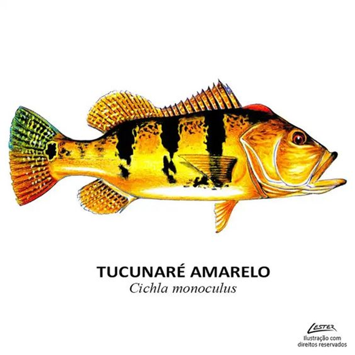
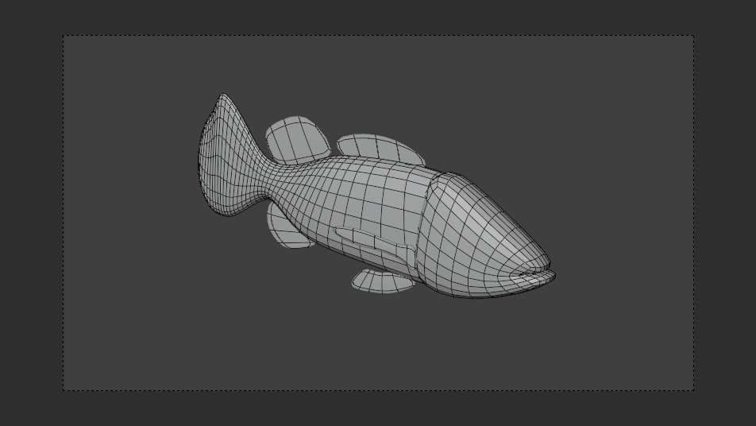
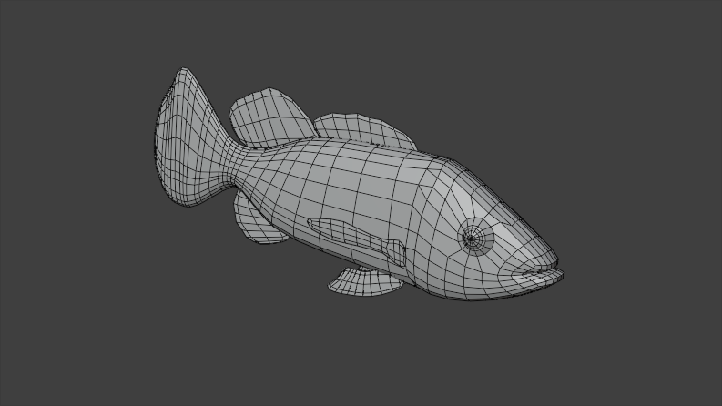
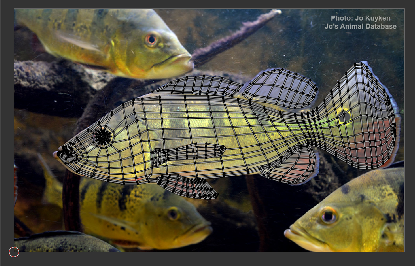
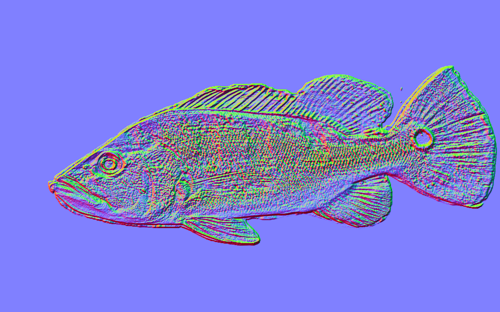
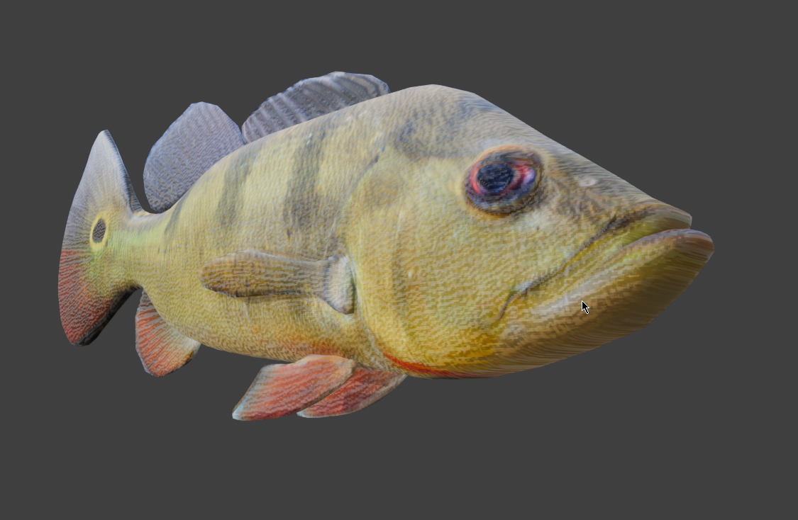
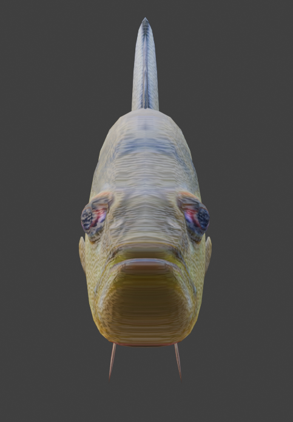

# Tucunaré

Essa foi a minha primeira demanda como artista 3D para o AKCIT. Confesso que fiquei um pouco intimidado pois não tinha uma habilidade muito grande com modelagens orgânicas (até hoje me considero iniciante). Mas, considerando o nível de habilidade que possuía de Blender e o prazo para a entrega, acredito que o resultado foi satisfatório o suficiente.

## Objetivo

Para conseguir atender à demanda do Museu Câmara Cascudo no projeto [Peixes do semiárido - nadando no seco](../../akcit/posts/peixes.md), eu precisava modelar, texturizar, riggar e animar um Tucunaré (*Chichla monoculus*) representado abaixo.

{ width="600"}

<figcaption>Representação em desenho da espécie <b><i>Chichla monoculus</i></b>.</figcaption>

## Processo

### Modelagem

De começo, seguindo uma imagem de referência, fiz a blocagem das partes base do peixe, como cabeça, corpo e barbatanas, com o intuito de juntá-las depois.

{ width="600"}

A segunda iteração serviu para modelar a boca dele.

{ width="600"}

Na terceira, consegui modelar os olhos e juntar a cabeça ao restante do corpo, bem como as barbatanas.

{ width="600"}

### Texturização

Como eu ainda não possuía nenhum tipo de experiência ou conhecimento prévio sobre texturização de formas orgânicas (principalmente animais) e principalmente pela demanda, optei pelo caminho mais fácil que foi utilizar uma imagem já pronta e realizar o unwrap do modelo para que coubesse perfeitamente nela.

{ width="600"}

Além disse, utilizei o site [NormalMap-Online](https://cpetry.github.io/NormalMap-Online/) para gerar um normal map baseado na imagem que utilizei, a fim de simular partes do peixe, como as escamas.

{ width="600"}

Essa abordagem não foi das melhores, gerando problemas de coesão como mostrado nas imagens abaixo. Mas, dado o tempo que fui imposto, imagino que tenha sido bom o bastante, principalmente levando em conta que os modelos seriam vistos por meio de uma projeção em uma sala fechado, com um vídeo pré renderizado da Unity.

{ width="600"}

<figcaption>"Escamas" nada realistas.</figcaption>

{ width="450"}

<figcaption>Parte frontal "esticada" devido ao uso da foto como textura.</figcaption>

### Animação
